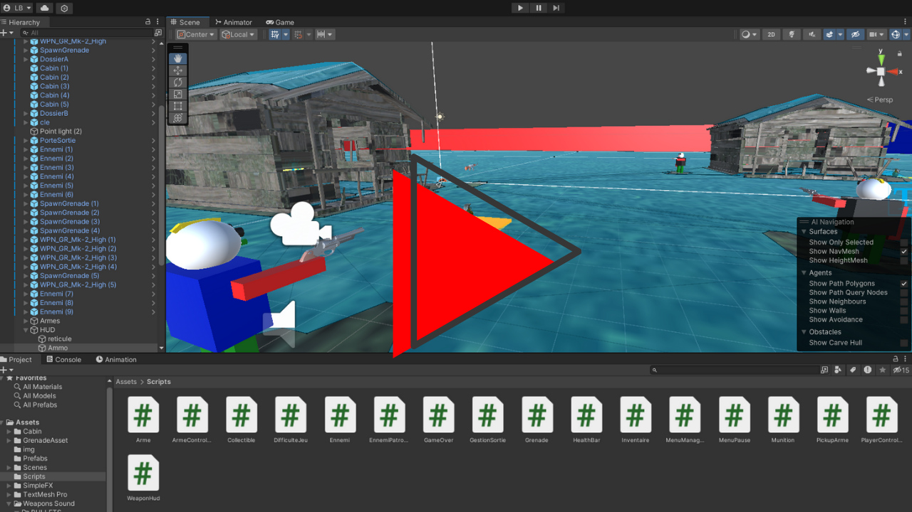

# Prototype FPS Unity

## Description
Ce projet est un prototype de jeu de tir à la première personne (**FPS**) développé sous Unity.  
Il met en avant plusieurs mécaniques :  
- Mouvement du personnage  
- Gestion des points de vie  
- Munitions  
- Utilisation de grenades  
- Gestion d’inventaire  
- IA ennemie  
etc.

---

## Démo vidéo
Cliquez sur la miniature ci-dessous pour visionner la démonstration du prototype :

[](https://youtu.be/3mprTev3IAA)

---

## Mouvement du personnage
- **Z / W** : Avancer  
- **S** : Reculer  
- **Q / A** : Déplacement latéral gauche  
- **D** : Déplacement latéral droit  
- **Souris gauche/droite** : Tourne la caméra (gauche/droite)  
- **Souris haut/bas** : Déplace la caméra vers le haut ou vers le bas (avec une limite)  
- **Maintenir Shift + (Z, Q, S, D)** : Courir

---

## Gestion PV (Dégâts sur l’ennemi)
- Tirer sur la **tête** inflige **4×** les dégâts de base (ex. 40 PV).  
- Tirer sur un **membre** inflige **25 %** des dégâts de base (ex. 2 PV).  
- **3 tirs** dans la tête ou **50 tirs** dans les membres suffisent à détruire l’ennemi.  
- L’ennemi laisse tomber **10 balles** à sa mort.  
- Le joueur peut ramasser ces balles (apparues au sol) mais ne peut pas dépasser **100 balles** en réserve.  
  - Les munitions supplémentaires ne sont pas ajoutées si on est déjà à 100.

---

## Gestion des Munitions
- **Clic gauche** : Tire et consomme 1 munition (HUD mis à jour).  
- Après **10 tirs**, le chargeur est vide et il faut **recharger** avec **R**.  
- Chaque rechargement diminue la réserve de munitions de **10** (ex. passe de 100 à 90, puis 80, etc.).  
- Si le joueur n’a plus de munitions du tout, il ne peut plus tirer.

---

## Grenade
- Des grenades sont disponibles sur des objets “SpawnGrenade” (une seule peut être ramassée à la fois).  
- Collisionner une grenade la ramasse et incrémente l’affichage près de l’icône grenade (en haut à droite).  
- **G** pour lancer la grenade.  
- La grenade **explose** dès qu’elle entre en collision avec un objet solide.  
- Les ennemis subissent des dégâts si l’explosion se produit à **2 unités** (distance) d’eux.

---

## Gestion Inventaire & Victoire
- Le joueur doit collecter **2 dossiers** et **1 clé** pour ouvrir la porte et gagner.  
- Collisionner un objet (dossier/clé) le ramasse.  
- Si tous les objets ne sont pas récupérés, un message informe des éléments manquants quand on essaie d’ouvrir la porte.  
- Le **chronomètre** s’arrête quand tous les objets sont ramassés et la porte est franchie : c’est la fin de partie.  
- À la **victoire**, le joueur ne peut plus bouger ni tirer. Un **message** s’affiche avec un bouton ramenant au MainMenu.

---

## Ennemis Attaque
- Quand le joueur est suffisamment proche, l’ennemi **suit** le joueur et **tire** régulièrement.  
- **33 % de chance** de toucher à chaque tir.  
- **1 tir / 2 secondes** ; inflige **10 PV** par tir réussi.  
- L’ennemi a **15 balles** dans son chargeur, puis doit **recharger** (3 s).  
- Ses munitions totales sont **illimitées**.  
- À sa mort, l’ennemi est détruit.  
- À la mort du joueur :  
  - Tous les ennemis sont détruits,  
  - Le jeu s’arrête,  
  - Un message d’échec apparaît avec un bouton pour réessayer.  
- Le bouton de réessai relance le jeu.

---

## Layout HUD
- Ramasser une grenade fait passer l’icône grenade de **0** à **1** (en haut à droite).  
- Le **temps** démarre au lancement du jeu, se met en pause avec **Échap (ESC)** et s’arrête lorsque le joueur meurt ou termine la mission.  
- **En haut à gauche** :  
  - Icône & nom de l’arme équipée.  
  - Change quand on alterne les armes (molette, Q, E).  
- **En bas à droite** :  
  - Nombre de balles dans le chargeur,  
  - Nombre de munitions en réserve,  
  - Indication de rechargement.  
- **En bas à gauche** :  
  - Barre de santé (du vert au rouge selon les dégâts).  
- À droite de l’icône de l’arme, on voit les **objets à récupérer** (dossiers/clé). Ces icônes se cochent quand l’objet est ramassé.

---

## Gestion des Armes
- Le joueur débute avec un **pistolet**.  
- Deux autres armes (Submachine Gun et Assault Rifle) peuvent être ramassées dans la scène.  
- On change d’arme avec **Q**, **E** ou la **molette** de la souris.  
- Le joueur ne peut pas stocker plus de **100 balles** en réserve.  
- **Capacité des chargeurs** :  
  - Pistolet : 10 balles  
  - Submachine Gun : 30 balles  
  - Assault Rifle : 20 balles  
- **Clic gauche** : Tirer.

---

## Particle System
- Tir avec n’importe quelle arme : effet de **fumée** au bout du canon.  
- Impact balle/surface : effet de **splash** (DirtSplash - SimpleFX).  
- Lancer de grenade : **explosion** à la collision.

---

## Installation & Utilisation
1. **Cloner** ce dépôt :  
   ```bash
   git clone git@github.com:lkbinks91/my-fps-game.git
